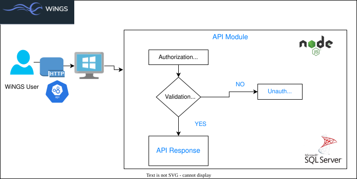
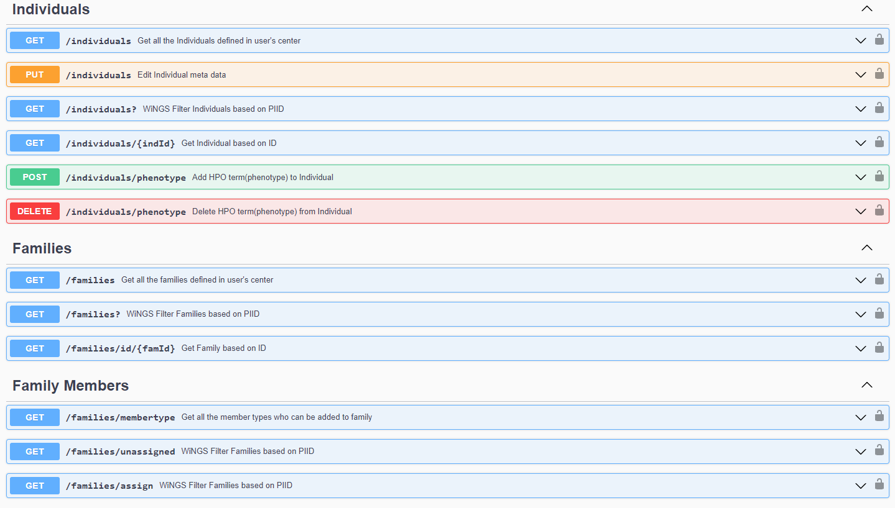

# REST API for Widely Integrated and federated NGS platform
## Overview
REST API is built on the framework of the existing WiNGS project. Existing WiNGS platform can be accessed as a Graphical User Interface using the link [WiNGS UI](https://wings-platform.org)  

## What is WiNGS ? 
Widely Integrated Platform for federated Next generation sequencing(WiNGS) is a system developed to analyze DNA sequencing data in a federated setup and privacy controlled manner. The existing platform was designed as a graphical user interface(GUI)  and this allows federated queries on data hosted in client’s infrastructure.

## WiNGS REST API
To enhance the usability of WiNGS and to cater the different requirements of WiNGS users, REST API feature was included. This can be used as a standalone API and can also be used to integrate with existing bio-informatics analysis tools. 

## How to use the API?
- Only Authenticated WiNGS Users can get access to the WiNGS REST APIs.
- The Authorization endpoints will be linked to WiNGS UI and allows authenticated WiNGS users to generate API Access Token using WiNGS UI.
- API Access Token allows access to the different endpoints which are available. 

## API Implementation Scheme

### API Documentation
- Swagger based Interactive API documentation provides details on the implemented endpoints, request parameters and the expected response.
- Please check https://wings.esat.kuleuven.be/rest-api/api-docs/ for detailed information.

### Swagger Documentation Snapshot
